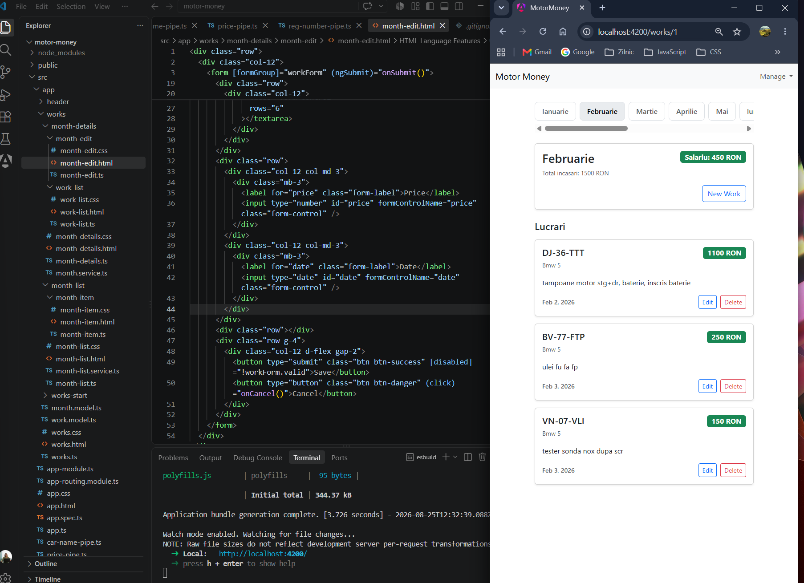

# Motor Money Manager

A web application for managing automotive workshop jobs, organized by month.

Motor Money Manager is a learning project built while developing my skills in Angular and TypeScript. The application allows workshop jobs to be added, edited, deleted, and organized according to their work date.

## Screenshot



## Features

- Add new automotive jobs
- Edit existing jobs
- Delete jobs
- Organize jobs by month
- Move a job to another month by changing its date
- Calculate monthly income
- Reactive Forms with validation
- Angular routing
- Custom pipes for data presentation
- Responsive, mobile-first interface

## Technologies

- Angular
- TypeScript
- HTML5
- CSS3
- Bootstrap
- RxJS
- Angular Reactive Forms
- Angular Router
- Git & GitHub

## Project Status

The project is currently under development.

The current version focuses on the Angular frontend and local application data.

## Future Improvements

- Connect the application to a REST API
- Add a Node.js / Express backend
- Store data in MongoDB
- Add persistent data storage
- Improve authentication and user management
- Continue improving the UI and user experience

## Running the project locally

Clone the repository and install the dependencies:

```bash
npm install
```

Start the Angular development server:

```bash
ng serve
```

Then open the application in your browser at:

`http://localhost:4200/`

## Author

Developed as part of my journey toward becoming a Frontend Developer, with a focus on Angular and TypeScript.
